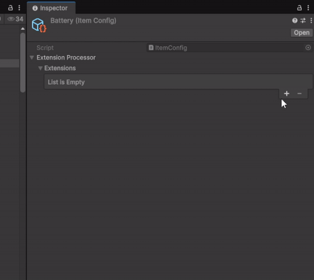
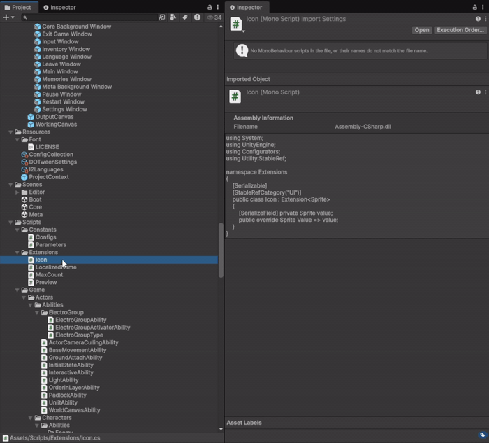
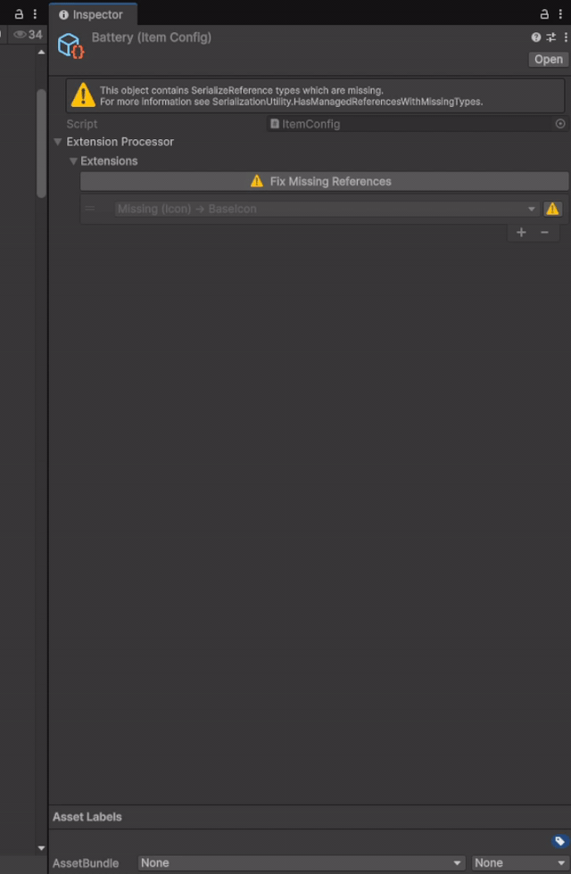

[](../../releases)
[](../../releases)
[](../../commits)
[](LICENSE.md)

**English** | [Русский](README.ru.md)

---

Rename your classes freely — serialized references won't break.

A serializable polymorphic reference wrapper for Unity that survives class renames. Built on top of `[SerializeReference]`, it stores a stable string type ID alongside the object so that renaming or moving a class does not break existing serialized data.

## Table Of Contents

<details>
<summary>Details</summary>

- [Installation](#installation)
- [The problem it solves](#the-problem-it-solves)
- [Classes and attributes](#classes-and-attributes)
- [Usage](#usage)
  - [Declaring a stable type](#declaring-a-stable-type)
  - [Using StableRef\<T\> in a field](#using-stablefrt-in-a-field)
  - [Using StableRefList\<T\>](#using-stablereflistt)
- [Auto-generated ID](#auto-generated-id)
- [Editor tools](#editor-tools)
- [License](#license)

</details>

---

## Installation

1. **.unitypackage** — [Releases](../../releases)
2. **UPM** — `Window → Package Manager` → `+` → `Add package from git URL`:
   `https://github.com/EgorShesterikov/Unity-StableRef.git`
   Append `#tag` to pin a version.
3. **Manual** — clone or download, copy to `Assets/`.

Unity 2021.3+

---

## The problem it solves

Unity's built-in `[SerializeReference]` stores the full assembly-qualified type name. If you rename or move a class, Unity loses the reference and the field becomes `null`. `StableRef` decouples the serialized identity from the class name by letting you assign a permanent ID via `[StableTypeId]`.

---

## Classes and attributes

| Type | Purpose |
|---|---|
| `StableRef<T>` | Serializable wrapper holding a single polymorphic reference of type `T`. |
| `StableRefList<T>` | Serializable list of `StableRef<T>` items. |
| `[StableTypeId("id")]` | Assigns a permanent ID to a class. Rename the class freely — Unity will still find it. |
| `[StableRefCategory("Path")]` | Groups the type under a submenu in the inspector selector. |

---

## Usage

### Declaring a stable type

```csharp
[Serializable]
[StableTypeId("my-package.damage-on-hit")]
[StableRefCategory("Combat")]
public class DamageOnHit : IEffect
{
    public int Amount;
}
```

The `[StableTypeId]` value must be unique across the project. Use a namespaced string to avoid collisions.

### Using StableRef\<T\> in a field

```csharp
[Serializable]
public class ItemConfig : ScriptableObject
{
    public StableRef<IEffect> OnPickup;
}
```

### Using StableRefList\<T\>

```csharp
[Serializable]
public class AbilityConfig : ScriptableObject
{
    public StableRefList<IEffect> Effects;
}

// Iteration
foreach (var stableRef in config.Effects)
{
    var effect = stableRef?.Value;
    if (effect != null)
        effect.Apply();
}
```

<p align="center">
  
</p>

---

## Auto-generated ID

`[StableTypeId]` is optional. If omitted, StableRef automatically uses the **MonoScript GUID** (the `guid` value from the `.meta` file) as the stable identifier. This means:

- **Class rename** — safe. The GUID is tied to the file, not the class name.
- **Script file rename or move** — also safe. Unity's meta file travels with the asset and its GUID does not change.
- **Deleting and recreating the file** — the reference is lost (resolves to `null`), but handled gracefully. The project continues to work; the missing type will appear in the Fix Missing Types report.

For types you plan to refactor heavily, an explicit `[StableTypeId]` is more reliable since it survives even if the script file is deleted and re-created.

---

## Editor tools

All tools are available under **Tools → StableRef** in the Unity menu bar.

**Find Usages** (`Tools/StableRef/Find Usages`) — scans prefabs, active scenes, and scriptable objects to show every place a selected type is used. Also accessible via right-click on a script asset: `Assets/Find StableRef Usages`.

<p align="center">
  
</p>

**Fix Missing Types** (`Tools/StableRef/Fix Missing Types`) — scans the project for StableRef fields that contain an ID that no longer maps to any known type. Useful after a refactor to find broken references before they become silent data loss.

<p align="center">
  
</p>

---

## License

Distributed under the [MIT License](LICENSE.md). Free for personal and commercial use.

Author — **Egor Shesterikov**.
